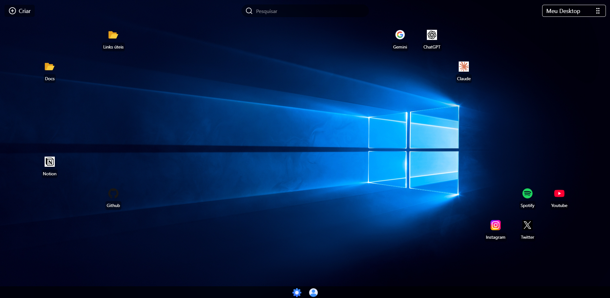
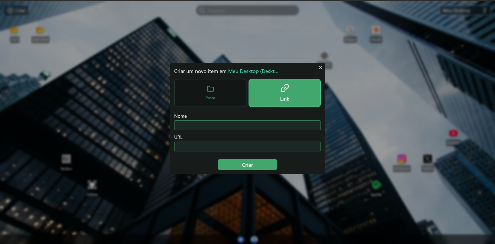
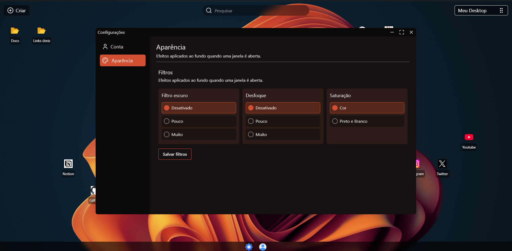
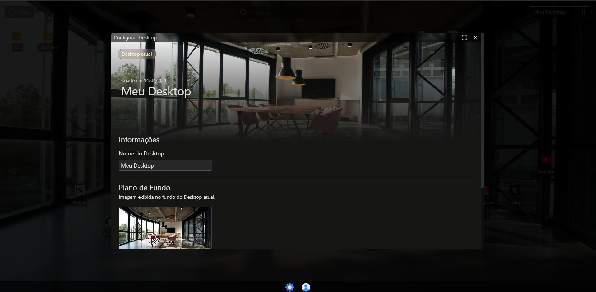
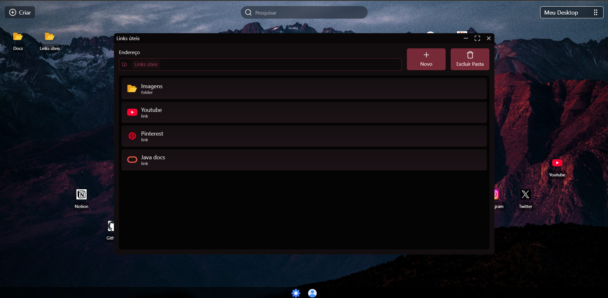
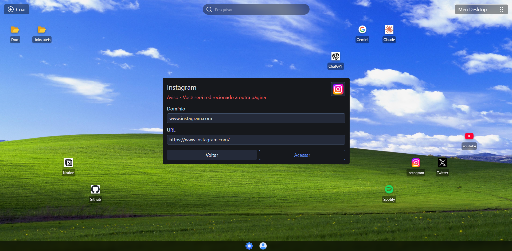

# Control

> A web-based virtual desktop platform inspired by the Windows interface.



## About

Control is a web platform where users can create virtual desktops to organize
links and folders in a visual and intuitive way.

## Features

- Virtual desktops with customizable wallpapers
- Drag and drop icons
- Recursive folder navigation
- Links with automatic favicon detection
- Multiple desktops per user
- Appearance filters (blur, darkness, saturation)

## Stack

**Frontend**
- React + Vite + TypeScript
- TailwindCSS

**Backend**
- Node.js + Express
- Prisma ORM
- PostgreSQL

## Screenshots











## Running locally

### Prerequisites
- Node.js 18+
- PostgreSQL running locally or via Supabase

### Installation

```bash
# Clone the repository
git clone https://github.com/boriloo/Control.git
cd Control

# Install dependencies
npm run install:all

# Set up environment variables
npm run copy-env

# OPTIONAL - Edit .env with your credentials
```

### Running

```bash
# From the project root (Make sure Docker is running)
npm run start:all
```

Access http://localhost:5173


## Project structure

```
control/
├── client/          # React frontend
│   ├── src/
│   │   ├── components/
│   │   ├── context/
│   │   ├── pages/
│   │   ├── services/
│   │   └── types/
└── server/          # Express backend
    ├── src/
    │   ├── controllers/
    │   ├── middlewares/
    │   ├── routes/
    │   ├── services/
    │   └── types/
    └── prisma/
        └── schema.prisma
```


